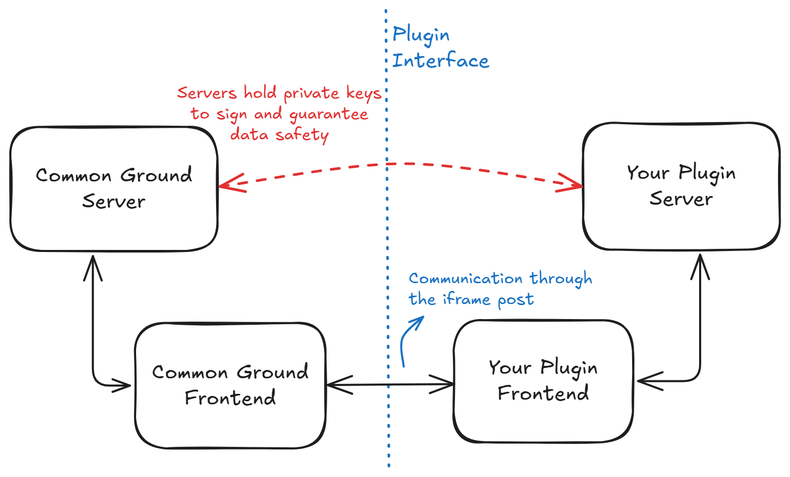
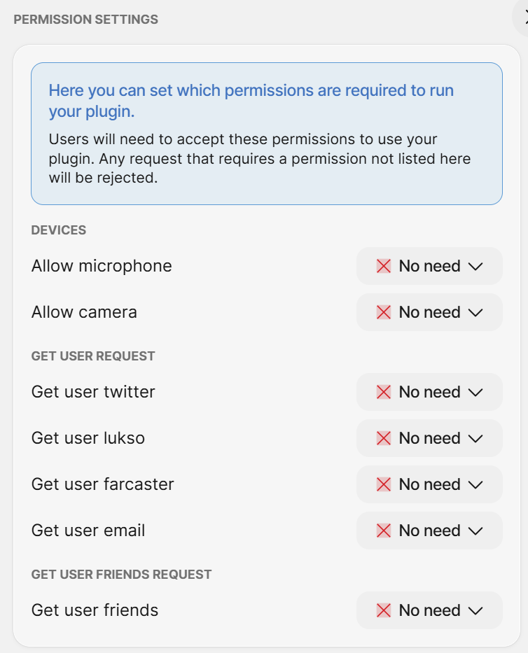

<div align='center'>
    <h1>Common Ground Plugin Library</h1>
</div>

The Common Ground Plugin Library enables developers to build secure plugins that can interact with Common Ground communities. It provides a standardized way to request user/community information and perform actions like role assignment through a sandboxed iframe environment.

## Features

- **Secure Communication**: All plugin-host communication is signed using public/private key pairs
- **Type Safety**: Full TypeScript support with shared type definitions
- **Permission Locked**: Configure mandatory and optional permissions to access features like the user accounts or camera/microphone access
- **Request Types**:
  - `getContextData`: Base context of the plugin: user id, plugin id, and the roles it is allowed to give.
  - `userInfo`: Get details about the current user including roles
  - `communityInfo`: Get community details including available roles
  - `userFriends`: Get the mutual friends of the current user
- **Action Types**:
  - `giveRole`: Assign roles to users (if plugin has permission)
  - `navigate`: Move to another page inside Common Ground or open a new tab somewhere else

## How does it work?



The Common Ground Plugin Library enables your application to interact with the Common Ground platform through a secure interface. Your application runs inside a sandboxed iframe within Common Ground, allowing you to build games, tools, and services that can access user and community data.

Due to the sandboxed environment, plugins communicate with Common Ground through a secure message passing system. Each request is cryptographically signed to ensure authenticity and security. This library handles all the complexity of request signing and provides a simple interface for accessing Common Ground features - you just make the requests you need and the library takes care of the security details.

The library exposes a strongly-typed API that clearly defines what operations are available to plugins. You can request through straightforward function calls without having to implement any of the underlying security mechanisms.

### Request limits
To ensure stable performance and prevent abuse, the following request limits are enforced:

- **Rate Limit**: Maximum 100 requests per minute to Common Ground
- **Navigation Limit**: Maximum 1 navigation request every 5 seconds
  - This prevents rapid navigation spam that could degrade user experience

Exceeding these limits will result in rejected requests. Your plugin should implement appropriate error handling for these cases.

## How do I create my plugin?
To create a plugin, follow these steps:

1. Go to the settings page of your Common Ground community
2. Click "Create New Plugin" 
3. Enter a name and URL for your plugin (these can be modified later)
4. Upon creation, you'll receive a private and public key pair
   - IMPORTANT: Save these keys immediately - they are only shown once
   - These keys are required for secure communication with Common Ground
   - If you lose the keys, you'll need to create a new plugin

Once your plugin is created, you can configure its permissions in the settings. These permissions control what your plugin can access:

- **Mandatory Permissions**: Users must accept these before your plugin starts
- **Optional Permissions**: Users can toggle these at any time
  - Your plugin should handle both enabled/disabled states



## How to use - Client
Add the client library to your project 
```bash
  npm install @common-ground-dao/cg-plugin-lib
```

To instantiate the client, you will need:
1. The iframe ID
2. Your public key
3. The API server route for signing requests
   - Signing requests is crucial for security, ensuring that no one can tamper with your frontend and impersonate you.
   - The route should be defined from the root of your application, typically something like '/sign'.

The iframe ID is always available as a search parameter "iframeUid" at the root of your application. Your public key is provided when you create the plugin. For more details on the API server route, refer to the section below.

Once initialized, you can always get the instance with ``CgPluginLib.getInstance()``:

```typescript
  const iframeUid = searchParams.get('iframeUid');
  const cgPluginLibInstance = await CgPluginLib.initialize(iframeUid, SIGN_ROUTE, MY_PUBLIC_KEY);

  // Later
  const cgPluginLibInstance = await CgPluginLib.getInstance();
```

## How to use - Server
Add the server library to your project
```bash
  npm install @common-ground-dao/cg-plugin-lib-host
```

The server library provides functionality for signing requests from your frontend. You'll need to create an API endpoint that receives requests from your frontend, signs them with your private key, and returns the signed request.

Here's a basic example of what the signing route could look like:
```typescript
router.post('/sign', async (req, res) => {
  try {
    const body = req.body;
    
    const cgPluginLibHost = await CgPluginLibHost.initialize(MY_PRIVATE_KEY, MY_PUBLIC_kEY);
    const signedRequest = await cgPluginLibHost.signRequest(body);

    res.json(signedRequest);
  } catch (error) {
    res.status(500).json({ error: 'Error signing request' });
  }
});
```

## Examples
To see a sample implementation of the plugin, check the [CG Sample Plugin](https://github.com/Common-Ground-DAO/CGSamplePlugin) repo.

## FAQ
### What if I lose my keys?
You can always just delete and create a new plugin for new keys. But if for some reason you really need the same keys again, try talking to our support.

### How do I test my still-in-development plugin on Common Ground?
When developing your plugin locally, you'll need a way to make it accessible to Common Ground. A simple solution is to use a reverse proxy like [ngrok](https://ngrok.com/docs/getting-started/). 

Be sure to only use this kind of reverse proxies for testing. Running your permanently like this could be a security hazard for your computer.